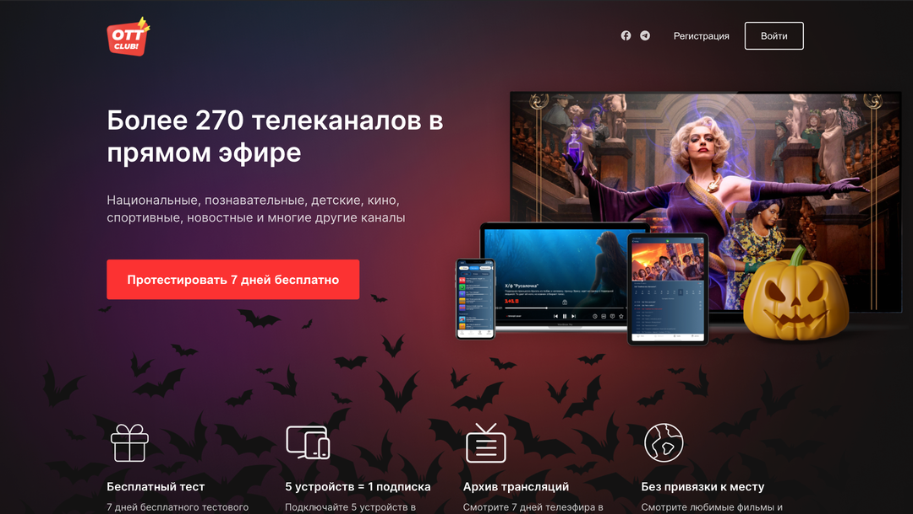

# Посадочна сторінка на React з використанням Styled Components

Це посадочна сторінка, розроблена з використанням React та Styled Components. Проект також включає адаптивну верстку "mobile first" для різних роздільностей екрану.

## Демо

Деякі зображення проекту на різних роздільностях екрану:

### Мобільний розмір (320px)

### Планшетний розмір (768px)

### Настільний розмір (1440px)

## Встановлення та запуск

1. Клонуйте репозиторій:
   git clone https://github.com/yourusername/your-project.git
2. Перейдіть у директорію проекту: cd your-project
3. Встановіть залежності: npm install
4. Запустіть проект: npm start

Проект буде доступний за адресою `http://localhost:3000`.

## Використані технології

- React
- Styled Components

